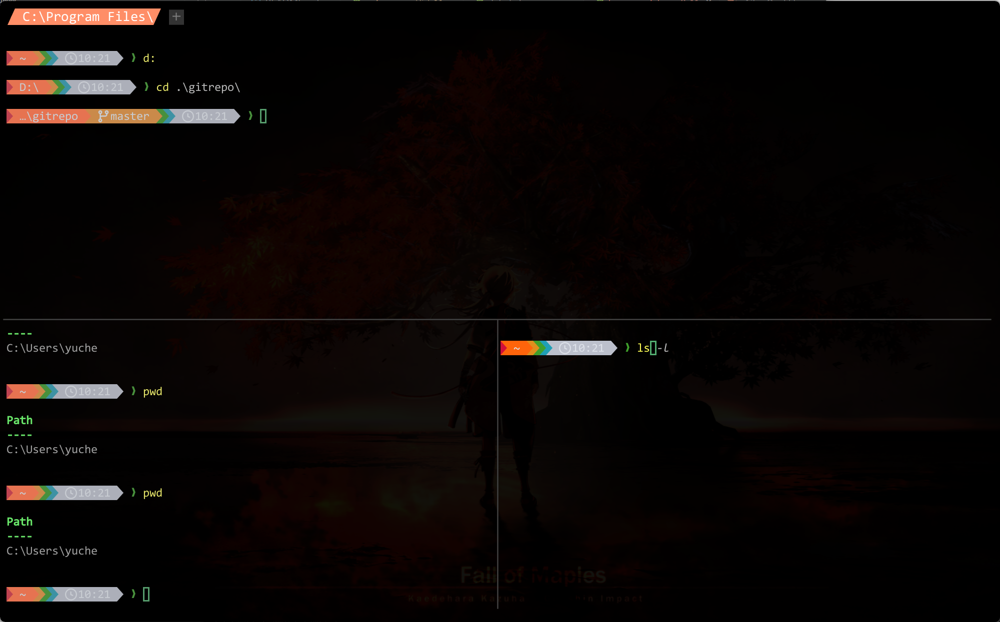
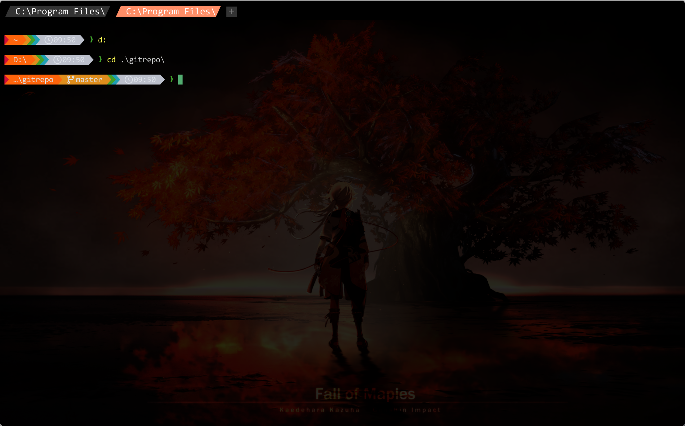

# WezTerm 配置总结

配置目录：`~/.config/wezterm`（Windows：`C:\Users\%userprofile%\.config\wezterm`）

官方文档：https://wezterm.org/config/lua/general.html

效果： **使用了 Consolas ligaturized 字体的透明 WezTerm：深色压暗背景图、居中 2000×1200 窗口、橙黑 隐藏标题栏,半透明窗体，禁用默认快捷键后自定分屏/标签/字体与拖窗绑定，默认启动 PowerShell**

---






> prompt 行的效果使用了 `starship`

> 使用时需要修改一下字体，也行你电脑上没有这个字体

## 目录结构

```
wezterm/
├── wezterm.lua      # 主配置
├── keys.lua         # 快捷键 / 鼠标绑定
└── img/             # 背景图资源
    └── wanye.jpg
```

---

## 主配置（`wezterm.lua`）

### 字体

| 项 | 值 |
|----|-----|
| 字体 | `Consolas ligaturized v3` |
| 字重 | Regular |
| 字号 | 12 |

### 输入法

- `use_ime = true`：启用系统 IME（中文等输入）

### 透明度与背景

| 项 | 值 | 说明 |
|----|-----|------|
| `window_background_opacity` | `0.95` | 窗口整体透明度 |
| 背景图 | `img/wanye.jpg` | 相对配置目录 |
| 填充 | `Cover` + 居中 | 铺满窗口并裁剪 |
| `hsb.brightness` | `0.02` | 压暗背景，保证文字可读 |
| `hsb.hue` / `saturation` | `1.0` | 不改色相/饱和度 |

> 切换背景：改 `config.background[1].source.File` 中的文件名即可。  
> 亮度建议范围：`0.05` ~ `0.3`（当前偏暗）。

Acrylic / OpenGL 前端相关项目前注释未启用。

### 默认 Shell 与启动菜单

- **默认程序**：`pwsh -NoLogo -NoExit`
- **Launch Menu**：
  - PowerShell Core（带 init 脚本；注意：`pwsh_init` 变量需在配置中定义才可用）
  - PowerShell Core（plain，无额外参数）
  - Git Bash（`C:\Program Files\Git\git-bash.exe`）

### 其它行为

- `automatically_reload_config = true`：改配置后自动重载
- **禁用全部默认快捷键**：`disable_default_key_bindings = true`，仅使用 `keys.lua` 中定义的绑定

### 窗口尺寸与位置

启动时（`gui-startup`）：

- 内窗大小：`2000 × 1200`
- 位置：相对当前显示器居中

### 窗口装饰与标签栏

| 项 | 值 |
|----|-----|
| 窗口装饰 | `RESIZE`（无系统标题栏，可调大小） |
| 标签栏样式 | Fancy tab bar |
| Tab 最大宽度 | 20 |
| 新建标签按钮 | 显示 |
| 关闭按钮 | 隐藏（`show_close_tab_button_in_tabs = false`） |
| 标题栏字体 | 同主字体，字号 14（影响 tab 栏高度） |
| 活动/非活动标题栏底色 | `#000000` |
| 标签栏背景 / 非活动边 | `#000000` |

### 自定义标签标题样式（`format-tab-title`）

- 非活动标签：背景 `#333333`，文字 `#FFFFFF`
- 活动标签：背景 `#ff8e67`，文字 `#FFFFFF`
- 两侧使用 Nerd Font 三角箭头装饰
- 标题过长时右侧截断，并预留箭头宽度

---

## 快捷键（`keys.lua`）

默认绑定已全部关闭，以下为当前生效快捷键。

### 标签

| 快捷键 | 作用 |
|--------|------|
| `Ctrl+Tab` | 下一个标签 |
| `Ctrl+Shift+Tab` | 上一个标签 |
| `Ctrl+1` … `Ctrl+6` | 切换到第 1–6 个标签 |
| `Alt+t` | 新建标签 |
| `Alt+c` | 关闭当前分屏（唯一 pane 时关标签，需确认） |

### 分屏

| 快捷键 | 作用 |
|--------|------|
| `Alt+\` | 左右分屏 |
| `Alt+-` | 上下分屏 |

### 字体大小

| 快捷键 | 作用 |
|--------|------|
| `Ctrl+=` / `Ctrl++` | 放大 |
| `Ctrl+-` | 缩小 |
| `Ctrl+0` | 重置字号 |

### 窗口 / 面板 / 搜索

| 快捷键 | 作用 |
|--------|------|
| `Alt+Enter` | 全屏切换 |
| `Ctrl+n` | 新建窗口 |
| `Ctrl+p` | 命令面板 |
| `Ctrl+f` | 搜索 |
| `Ctrl+Shift+x` | 进入 Copy Mode |


### 鼠标

| 操作 | 作用 |
|------|------|
| `Ctrl+Alt` + 左键拖拽 | 拖动整个窗口 |

---

## 常用调整

| 想改什么 | 改哪里 |
|----------|--------|
| 背景图 | `wezterm.lua` → `config.background` → `File` |
| 背景明暗 | `hsb.brightness` |
| 窗口透明度 | `window_background_opacity` |
| 启动大小/居中 | `WINDOW_WIDTH` / `WINDOW_HEIGHT` |
| 字体 / 字号 | `config.font` / `config.font_size` |
| 活动标签颜色 | `format-tab-title` 里 `tab.is_active` 分支 |
| 快捷键 | `keys.lua` |
